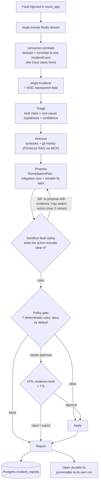
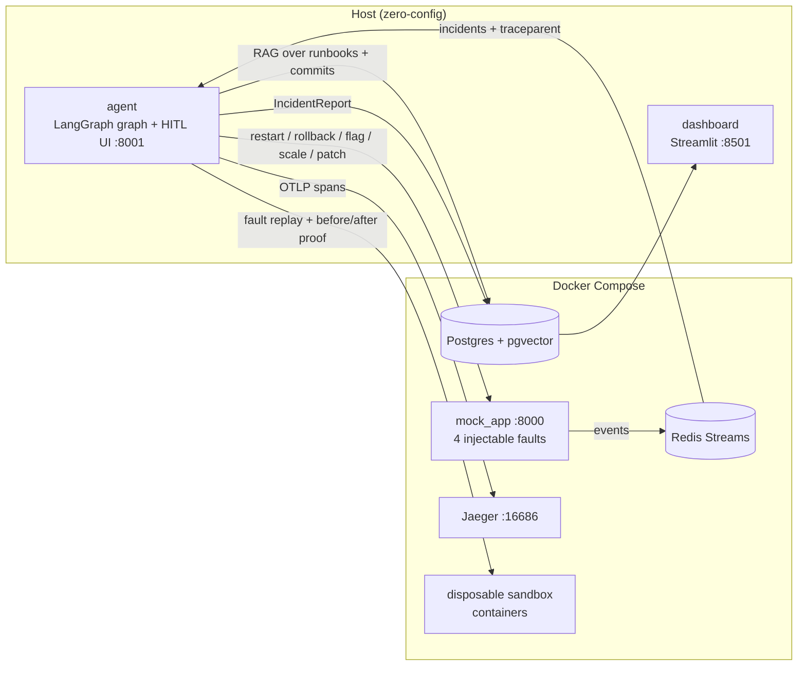

# Aegis — Self-Healing Incident-Response Agent

Aegis is an agentic system that consumes incidents off a live event stream, decides on a
remediation, **proves the action actually clears the fault by replaying it in an isolated
sandbox**, gates it through a deterministic deny-by-default policy engine, asks a human for
approval with evidence, applies it, and reports the outcome — with the whole lifecycle
measured and traced.

It is built to demonstrate production-grade agent infrastructure rather than a chatbot demo:
real async ingestion, empirical verification of LLM proposals, auditable guardrails, and
human-in-the-loop safety.

## How it works

```
incident (Redis stream)
  → Triage      classify the fault + root-cause hypothesis + confidence   (LLM)
  → Retrieve    pull relevant runbooks / git history                       (PGVector RAG via MCP)
  → Propose     emit a RemediationPlan: mitigation now + durable fix later (LLM)
  → Sandbox     replay the fault in a disposable container, prove recovery (Docker)
      fail → re-propose with the failure evidence (may switch actions), max 3 attempts
  → Policy      deterministic 7-rule, deny-by-default gate                 (allow / needs_approval / block)
  → HITL        evidence-based approval brief with a TTL                   (web UI)
  → Apply       per-action applier restarts / rolls back / patches the live service
  → Report      persist an IncidentReport; file the durable fix as a follow-up
```

The **mitigation** runs the full pipeline now; the **durable fix** (a drafted code patch) is
filed as a follow-up and can be **promoted to its own pipeline run** with one click in the UI.

### Action catalog

`restart_service`, `rollback`, `toggle_feature_flag`, `scale_out`, `patch_code`, `escalate` —
each with declared safety metadata (blast radius, reversibility) that the policy engine consumes.

## Architecture

### Incident lifecycle



### Service topology



## Measured results

Every number below is produced by the eval harness (`evals/run_evals.py --tier 1|2|3|4`, plus
`python -m evals.experiments.model_tiering` for the sweep) and written to a committed,
timestamped JSON in `evals/results/`. The dashboard's Evaluation tab renders the five headline
metrics, the G-Eval rubric, and the tiering comparison.

> Result JSONs record the code sha at generation time — the commit that *adds* a result
> file is necessarily one commit later than the sha inside it.

| Metric | Result | n | Tier |
|---|---|---|---|
| Unsafe actions blocked | 100% | 18 | 1 — runs in CI on every commit |
| Triage accuracy | 100% | 18 | 2 |
| Action-selection accuracy | 100% | 18 | 2 |
| Retrieval recall@3 / precision@1 | 100% / 100% | 18 | 2 |
| Remediation success (fault empirically cleared in sandbox) | 100% | 4 (one per fault kind; `--tier3-all` runs all 18) | 3 |
| End-to-end outcome accuracy | 100% | 4 | 4 |
| Root-cause reasoning quality (G-Eval rubric) | 0.40 / 1.00 | 18 | 2 |
| Cost reduction from model tiering | −31% (Haiku triage) / −74% (all-Haiku) | 18 × 4 configs | experiment |

### How to read these numbers

**Triage accuracy is the easy part.** The fault kind is present in the triage prompt, so
classification is close to trivial — 100% here is table stakes, not the achievement. The
interesting question is whether the agent's *root-cause reasoning* holds up, which is
exactly why a fuzzy judge scores it separately.

**G-Eval 0.40 is a moderate score, not "60% wrong".** G-Eval rubrics rarely award above
0.7 even for strong answers, so this judge's practical ceiling is around 0.7. The real
finding is structural: triage runs *before* retrieval, so it cannot know code-level
mechanisms (for `error_spike`, that the 5xx are tied to a feature flag) from a sparse
alert. The fuzzy metric exposes a quality ceiling that the deterministic 100%s cannot see.

**Model tiering: cost is the deterministic claim.** Cost is computed from token counts
against a static pricing table, so it reproduces exactly. Single-run accuracy deltas over
18 cases are sampling noise — an earlier two-config run showed a 6% action-selection drop
that vanished on re-run, which is why per-case results are stored in the artifact.
Action-selection accuracy is also coarse set membership: it does not measure patch-draft
or root-cause quality, so the sweep supports "Haiku for triage is free" without claiming
all-Haiku matches all-Sonnet on finer quality. That is why the strong model stays on the
propose node.

**Traces root at correlation, not at fault injection.** Correlation fans many raw events
into one incident, so there is no single upstream emit to root a per-incident trace at.
The Jaeger waterfall therefore spans *correlation → applied fix*, carrying `traceparent`
across the Redis boundary into the agent process.

Five headline metrics plus the G-Eval rubric are the load-bearing claims. Three further
diagnostics (`mean_confidence`, `pct_below_confidence_floor`, `durable_fix_valid_path_rate`)
are recorded to interpret behaviour, not as headline results. Metrics for tiers 2–4 are
computed over live, non-deterministic LLM runs, so small run-to-run variation is expected.

## Tech stack

| Layer | Choice |
|---|---|
| Language | Python 3.11+ |
| Target app / faults | FastAPI (4 injectable, reproducible faults) |
| Event stream | Redis Streams |
| Agent orchestration | LangGraph |
| LLM | Anthropic Claude, tiered per node |
| Retrieval | PGVector on PostgreSQL (via an MCP tool) |
| Safe execution | Docker SDK — fault-replay sandbox |
| Policy engine | Custom deterministic rules (stateful) |
| HITL | Local FastAPI web UI |
| Tests | pytest |

## Status

| Phase | Scope | State |
|---|---|---|
| 1 | Typed contracts + mock-app faults | ✅ Done |
| 2 | Sandbox fault-replay | ✅ Done |
| 3 | Policy engine + tier-1 evals in CI | ✅ Done |
| 4 | Agent nodes, reflective retry, live appliers, HITL, reports | ✅ Done |
| 5 | Observability (OpenTelemetry + Jaeger + structlog + LangSmith) | ✅ Done |
| 6 | Eval pyramid + model-tiering experiment | ✅ Done |
| 7 | Streamlit dashboard + writeup | ✅ Done |

## Running it

Requires Docker Desktop and Python 3.11+.

```bash
# 1. Bring up the stack (target app, Redis, Postgres/pgvector, Jaeger)
docker compose up -d redis postgres app consumer jaeger

# 2. Seed the retrieval corpus (runbooks + git history)
python -m retrieval.ingest

# 3. Trigger a fault, then run the agent against the latest incident
#    (the agent runs on the host; the HITL UI serves at http://localhost:8001)
python -m agent.main --count 1
```

Set `ANTHROPIC_API_KEY` in a `.env` file first (the agent loads it on startup).
The **Jaeger UI** (one trace-waterfall per incident) serves at http://localhost:16686;
`python -m observability.demo` triggers a fault and prints the trace URL.

> **Host-run notes** (the agent runs on the host and spawns the retrieval MCP server as a
> stdio subprocess, so a few environment details matter):
>
> - **Run from a real console.** Use **PowerShell**, or `winpty python -m agent.main` under
>   Git Bash. The MCP stdio handshake is unreliable under Git Bash's *mintty* pseudo-console
>   on Windows and fails with `McpError: Connection closed`; a real console works.
> - **Keep `.env` hostname-free.** Host-run is zero-config — code defaults target the published
>   container ports. Remove any `REDIS_URL`, `POSTGRES_HOST`, or `LIVE_APP_URL` lines; those are
>   compose-only and resolve to unreachable container hostnames on the host.
> - **Set `HF_HUB_OFFLINE=1`** once the embedding model is cached, so the retrieval server loads
>   it offline instead of stalling on the Hugging Face Hub.
> - LangSmith LLM tracing is optional and off by default; set `LANGCHAIN_TRACING_V2=true` **and**
>   a `LANGCHAIN_API_KEY` to enable it (enabling the flag without a key produces 401 noise).

### Dashboard

```bash
pip install -e ".[dashboard]"
streamlit run dashboard/app.py     # http://localhost:8501
```

Two tabs, two data sources: **Operations** reads the `incident_reports` table (outcomes,
attempted-action trails, open durable fixes, expired approvals, per-incident cost and
per-node p50/p95 latency); **Evaluation** reads `evals/results/*.json` (headline metrics,
run-over-run trend, model-tiering comparison). It is a read-only viewer and runs on the
host like the agent — no extra container.

## Tests

```bash
# Fast suite (needs Postgres running; two integration tests hit the database)
python -m pytest tests/ -m "not docker" -q

# Integration suite (needs Docker; takes roughly 20 minutes)
python -m pytest tests/ -m docker -q
```

---

*Portfolio project by Fariz Akbarzada.*
